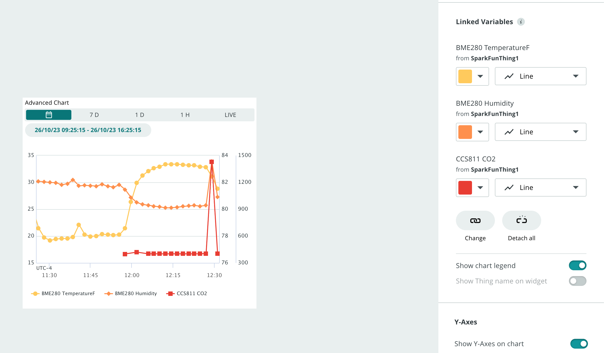

## SparkFun DataLogger Iot Firmware - Version 1.1

_November 11th, 2023_

Today we’re releasing the latest firmware update for our line of DataLogger IoT products. While we’ve released a services of small defect correct releases over the base 6 months, this release, officially version v1.01.00, is the first to include major new functionality.

And with the release, we feel we’ve covered all aspects of a 1.1 release – new functionality, feature enhancements, and a wide variety of bug fixes.  

### New Feature – Arduino IoT Cloud Connectivity

Being an IoT focused product, one of our goals is to enable easy access to leading IoT data services. With this in mind, for this release we worked closely with the Arduino Team to enabled easy access to the Arduino IoT Cloud directly from a DataLogger IoT Device.

Setup a device in the Arduino IoT Cloud, add the credentials to your DataLogger IoT and you have a IoT based dashboard up and running in minutes. Want to add an additional device to your dashboard – add the device to the DataLogger IoT and the combined system automatically adds the additional data to the Arduino Cloud – ready for use in your dashboard.

The above image shows data from a DataLogger IoT with an Environmental Combo attached to it and mapping data to a plot graphic on an Arduino IoT Cloud dashboard.

And like all DataLogger IoT functionality, no programming is required to produces these plots – all settings are provided via the intuitive serial console menu interface or set via a settings JSON file.

With the combination of the DataLogger IoT, qwiic and Arduino IoT Cloud, creating a IoT dashboard is as easy as *Plug-in, Connect, Plot!*

## New qwiic Sensor Board Support

The original release of the DataLogger IoT firmware supported around 50 SparkFun qwiic development boards and with this release we’ve added six boards additional qwiic boards.

Selecting from our recently added qwiic products as well as from the list of popular products, the release of version 1.1 adds support for the following qwiic development boards.

* SparkFun Indoor Air Quality Sensor - ENS160
* SparkFun Photoacoustic Spectroscopy CO2 Sensor - PASCO2V01
* SparkFun Human Presence and Motion Sensor - STHS34PF80
* SparkFun Tristimulus Color Sensor - OPT4048DTSR
* SparkFun Triad Spectroscopy Sensor - AS7265x
* SparkFun 6DoF IMU Breakout - BMI270

Like previously supported qwiic boards, the DataLogger IoT firmware automatically detects when a device is connected, making the new device automatically available to the logging, menu and IoT systems of the DataLogger IoT.

All these new sensors are great adds on their own, but the ENS160 has the additional feature of supporting temperature and humidity calibration inputs. Connect an BME280 or an SHTC3 qwiic board along with an ENS160, and the DataLogger automatically connects the two devices!

## Feature Improvements

In addition to the new functionality, we also took input from our customers (and our own use) to expand and enhance existing features. While a wide variety of small additions were made, a few notable additions include:

**Improved Reference Clock Management –** the internal logic was reviewed and improved. Additionally, time zone support was moved out of the NTP system, and into the overall clock management subsystem.

**Internal JSON Buffer Limits –** The initial firmware had fixed sizes for the internal JSON data buffers used for saving settings and log data output. These values are now user settable in the settings menu. This allows for larger buffer support, as well as reducing the internal buffers to what you need.

**Add Device IDs to the Device Names –** As you add more devices to a DataLogger, it’s difficult to match the device to the actual devices address. Addresses are now included in device listings and the option to include the address in the device name is now available.

**Board Information in the Log Stream –** To improve identification of a data source within the data log stream, the Board Name and Board ID can now be added if desired. As part of this functionality, a configurable name is now available for each DataLogger IoT.

## Bug Fixes

We also squashed a variety of defects in the firmware. Some of the more notable issued fixed in this release:

* Incorporated a fix in the RV8803 RTC Clock Arduino Library that resolved force ti*  shifts based on time zone. This was a “real nasty one” to resolve!
* Improved runtime memory (ram) consumption
* Resolved issues with devices having the same name. Now the second device adds it*  address to the name.
* Improvements to the Machinechat IoT driver

## In Summary

With the release of DataLogger IoT firmware version 1.1.0 we continue to enhance the capabilities of our DataLogger IoT line – adding to our IOT service, supported devices as well as improving the overall quality of the system.

And this new functionality is available today at the DataLogger [repo](https://github.com/sparkfun/SparkFun_DataLogger).  The update is free, available as an over-the-air upgrade, or as a file uploaded via an SD Card.  Just select the “System Update” option within the DataLogger IoT menu system and select your desired upgrade option.
